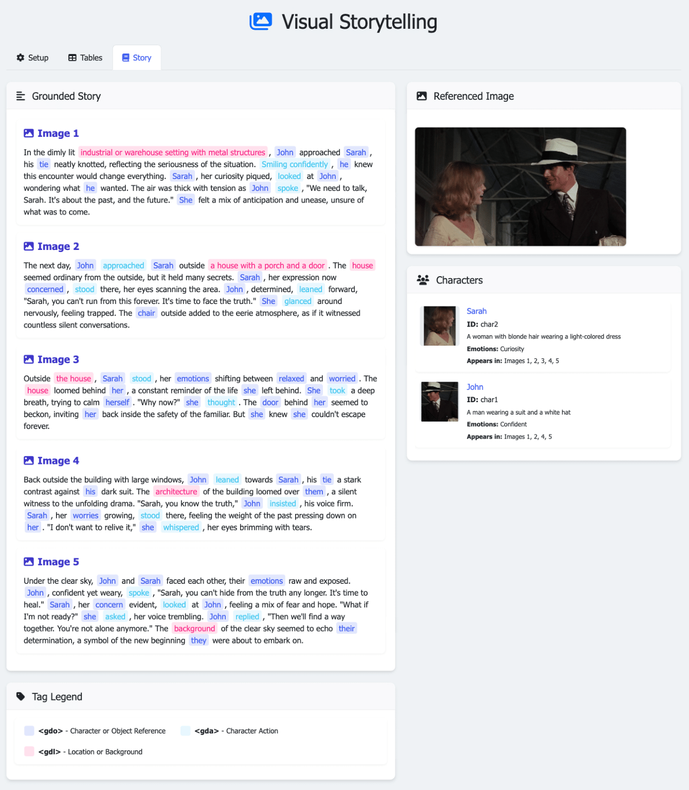
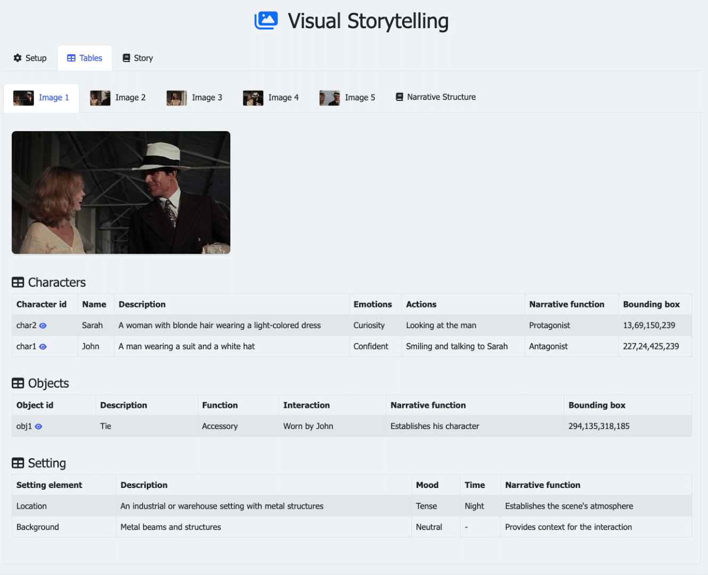

# StoryReasoning and Qwen Storyteller

A dataset and model framework for creating coherent visual stories with consistent character identity and object references across multiple frames.

## Overview

StoryReasoning is a dataset and framework that addresses key challenges in visual storytelling:
- Maintaining character and object identity across multiple frames
- Grounding textual elements to visual entities
- Reducing referential hallucinations
- Constructing coherent narratives from image sequences

This repository contains the code for Qwen Storyteller, a fine-tuned model based on Qwen2.5-VL 7B that performs end-to-end object detection, re-identification, and grounded story generation.

## Key Features

- **Cross-Frame Consistency**: Maintains consistent character and object identity across multiple frames through visual similarity and face recognition
- **Chain-of-Thought Reasoning**: Explicit modeling of characters, objects, settings, and narrative structure
- **Grounded Storytelling**: Uses specialized XML tags to link narrative elements directly to visual entities
- **Reduced Hallucinations**: Achieves 12.3% fewer hallucinations compared to the non-fine-tuned base model

## Dataset

The StoryReasoning dataset contains 4,178 stories derived from 52,016 movie images with structured scene analyses, grounded stories, and consistent character references.

Access the dataset: [StoryReasoning on HuggingFace](https://huggingface.co/datasets/daniel3303/StoryReasoning)

## Model

Qwen Storyteller is a fine-tuned version of Qwen2.5-VL 7B specialized for grounded visual storytelling.

Access the model: [Qwen Storyteller on HuggingFace](https://huggingface.co/daniel3303/QwenStoryteller)

## Installation

```bash
# Clone the repository
git clone https://github.com/daniel3303/StoryReasoning.git
cd StoryReasoning

# Install dependencies
pip install -r requirements.txt
```

## Web Interface

The repository includes a web-based visualization interface that connects with vLLM for real-time story generation and interpretation. The interface is available by opening the file `story_reasoning/visualization/web_interface.html` in a web browser.
The interface provides:
- Real-time generation with stream processing
- Color-coded entity tags
- Direct visual grounding with bounding boxes
- Interactive character and object highlighting
- Table visualization for structured scene analysis


*The story visualization component with color-coded entity tags that highlight corresponding visual elements when hovered*


*The tabbed interface for Chain-of-Thought analysis showing structured information about characters, objects, and settings*

## Usage

### Basic Usage with Transformers

```python
from transformers import Qwen2_5_VLForConditionalGeneration, AutoProcessor
from qwen_vl_utils import process_vision_info
import torch
from PIL import Image

# Load the model
model = Qwen2_5_VLForConditionalGeneration.from_pretrained(
    "daniel3303/QwenStoryteller", torch_dtype="auto", device_map="auto"
)

# Load processor
processor = AutoProcessor.from_pretrained("daniel3303/QwenStoryteller")

# Load images
images = [
    Image.open("image1.jpg"),
    Image.open("image2.jpg"),
    Image.open("image3.jpg"),
]

# Create image content list
image_content = []
for img in images:
    image_content.append({
        "type": "image",
        "image": img,
    })

# Add text prompt at the end
image_content.append({"type": "text", "text": "Generate a story based on these images."})

# Create messages with system prompt
messages = [
    {
        "role": "system", 
        "content": "You are an AI storyteller that can analyze sequences of images and create creative narratives. First think step-by-step to analyze characters, objects, settings, and narrative structure. Then create a grounded story that maintains consistent character identity and object references across frames. Use <think></think> tags to show your reasoning process before writing the final story."
    },
    {
        "role": "user",
        "content": image_content,
    }
]

# Preparation for inference
text = processor.apply_chat_template(
    messages, tokenize=False, add_generation_prompt=True
)
image_inputs, video_inputs = process_vision_info(messages)
inputs = processor(
    text=[text],
    images=image_inputs,
    videos=video_inputs,
    padding=True,
    return_tensors="pt",
)
inputs = inputs.to(model.device)

# Generate the output
generated_ids = model.generate(
    **inputs, 
    max_new_tokens=4096,
    do_sample=True,
    temperature=0.7,
    top_p=0.9
)
generated_ids_trimmed = [
    out_ids[len(in_ids):] for in_ids, out_ids in zip(inputs.input_ids, generated_ids)
]
story = processor.batch_decode(
    generated_ids_trimmed, skip_special_tokens=True, clean_up_tokenization_spaces=False
)[0]

print(story)
```

### Faster Inference with vLLM

For significantly faster inference, you can use vLLM to serve the model:

```bash
# Install vLLM
pip install vllm

# Serve the model with vLLM
vllm serve daniel3303/QwenStoryteller
```

You can then connect the web interface to the vLLM server for real-time story generation.

## Output Format

Qwen Storyteller produces two main outputs:

1. **Chain-of-Thought Analysis** (`<think></think>`): Structured analysis with character, object, setting, and narrative tables
2. **Grounded Story**: A narrative with specialized XML tags linking text to visual elements:
    - `<gdi>`: Image tags for specific frames
    - `<gdo>`: Entity reference tags for character and object mentions
    - `<gda>`: Action tags for character actions
    - `<gdl>`: Location/landmark tags for background elements

## Training Your Own Model

We provide scripts to fine-tune Qwen2.5-VL on the StoryReasoning dataset:

```bash
# Run LoRA fine-tuning
python train.py --lora-rank 2048 --lora-alpha 4096 --batch-size 32 --learning-rate 1e-4

# Run full model fine-tuning
python train.py --full-finetune --batch-size 64 --learning-rate 2e-5
```

## Citation

If you use this code or dataset in your research, please cite:

```bibtex
@inproceedings{oliveira2025story,
  title={StoryReasoning Dataset: Using Chain-of-Thought for Scene Understanding and Grounded Story Generation},
  author={Oliveira, Daniel A. P. and Matos, David Martins de},
  booktitle={Proceedings of the Neural Information Processing Systems},
  year={2025}
}
```

## Contact

Daniel A. P. Oliveira (daniel.oliveira@inesc-id.pt)